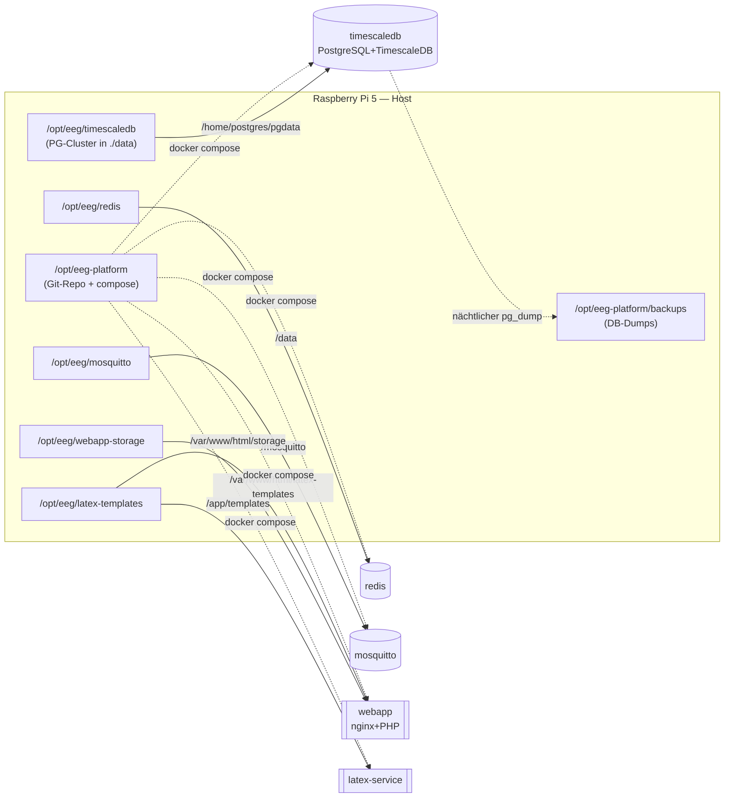

# Pfade & Mount-Points — Wo liegt was?

Diese Übersicht existiert, damit bei einem Zwischenfall **sofort** klar ist, welches Host-
Verzeichnis in welchen Container gehängt wird und wo die echten Daten liegen. Sie hat schon
einmal einen tagelangen (scheinbaren) Datenverlust ausgelöst — siehe **„Der PGDATA-Fallstrick"**
ganz unten. Quelle der Wahrheit ist immer `docker-compose.yml`; diese Datei erklärt sie.

## Host-Verzeichnisse (Produktivserver, Raspberry Pi 5, NVMe)

| Host-Pfad | Inhalt |
|-----------|--------|
| `/opt/eeg-platform/` | **Git-Repo** (Branch `main`), `docker-compose.yml`, `.env`, Skripte |
| `/opt/eeg-platform/backups/` | **DB-Dumps** (`eeg_JJJJMMTT_HHMM.dump`, aus `scripts/backup.sh`; nicht in Git) |
| `/opt/eeg/` | **Persistente Daten aller Container** (unbedingt ins Backup!) |

## Bind-Mounts (Host → Container)

| Host-Pfad | → Container-Pfad | Service | Zweck |
|-----------|------------------|---------|-------|
| `/opt/eeg/timescaledb` | `/home/postgres/pgdata` | **timescaledb** | **PostgreSQL-Cluster** (PGDATA = `…/pgdata/data`, Host: `/opt/eeg/timescaledb/data`) |
| `./database/init.sql` | `/docker-entrypoint-initdb.d/init.sql` | timescaledb | Schema **nur beim allerersten** Start einer leeren DB |
| `/opt/eeg/redis` | `/data` | redis | Session-Cache-Persistenz |
| `/opt/eeg/mosquitto/data` | `/mosquitto/data` | mosquitto | MQTT-Broker-Daten |
| `/opt/eeg/mosquitto/log` | `/mosquitto/log` | mosquitto | MQTT-Log |
| `./docker/mosquitto/config/mosquitto.conf` | `/mosquitto/config/mosquitto.conf` | mosquitto | Broker-Config (aus Repo) |
| `/opt/eeg/webapp-storage` | `/var/www/html/storage` | **webapp** | **Uploads, Beitrittserklärungen, generierte PDFs** |
| `/opt/eeg/latex-templates` | `/var/www/html/latex-templates` | webapp | LaTeX-Vorlagen (Platform-Admin lädt hoch) |
| `/opt/eeg/latex-templates` | `/app/templates` | latex-service | dieselben Vorlagen (latex-service liest sie) |
| `/opt/eeg/traefik/letsencrypt` | `/letsencrypt` | traefik | (praktisch ungenutzt — SSL macht der externe nginx-Proxy) |
| `/var/run/docker.sock` | `/var/run/docker.sock` (ro) | traefik | Docker-Labels lesen fürs Routing |

> Alle `/opt/eeg/...`-Verzeichnisse, in die die Container schreiben, gehören dem jeweiligen
> Container-User: `webapp-storage` + `latex-templates` = **UID 82** (www-data im Alpine-Image),
> `timescaledb` = **UID 1000** (postgres im timescaledb-ha-Image). Nach manuellem Neuanlegen
> immer `chown` passend setzen, sonst schreibt der Container nicht.

## Diagramm



---

## Der PGDATA-Fallstrick (Ursache des Vorfalls vom 23.07.2026)

**Was passiert war:** Der Mount stand ursprünglich auf `/opt/eeg/timescaledb:/var/lib/postgresql/data`.
Das `timescale/timescaledb-ha`-Image legt sein Datenverzeichnis aber unter
**`/home/postgres/pgdata/data`** ab, **nicht** unter `/var/lib/postgresql/data`. Solange die
alte Image-Version lief, passte das noch (sie nutzte damals `/var/lib/postgresql/data`). Am
**18.06.2026** hat der bewegliche Tag `:pg16` im Hintergrund eine neue Image-Version gezogen, die
PGDATA verschoben hat. Ab da schrieb PostgreSQL in ein **nicht gemountetes** Verzeichnis im
Container (flüchtig). Das fiel erst auf, als der Container am **23.07.** neu erstellt wurde und
der flüchtige Speicher weg war → die DB wirkte „leer".

**Warum es keinen echten Datenverlust gab (fast):** Der eigentliche Cluster bis 18.06. lag
weiter auf der Platte; der Betrieb bis 16.07. war im nächtlichen Dump gesichert. Wiederhergestellt
wurde aus `backups/eeg_20260716_1859.dump`.

**Dauerhafte Absicherung (seit diesem Commit):**
1. **Mount korrigiert** auf `/opt/eeg/timescaledb:/home/postgres/pgdata` — trifft das echte
   PGDATA des Images, Daten liegen persistent unter `/opt/eeg/timescaledb/data`.
2. **Image auf feste Digest gepinnt** (`timescaledb-ha:pg16@sha256:cbc4399…`) — der bewegliche
   Tag kann PGDATA nicht mehr unbemerkt verschieben. Aktualisieren nur noch **bewusst** durch
   Ändern der Digest.
3. **Backup gehärtet** (`scripts/backup.sh`): prüft den Dump auf Gültigkeit, rotiert, und
   **alarmiert per E-Mail** ans Admin-Postfach, wenn ein Backup fehlschlägt.

**Schnell-Check, ob PGDATA korrekt persistent ist:**
```bash
docker compose exec -T timescaledb bash -lc 'echo $PGDATA'          # muss /home/postgres/pgdata/data sein
sudo find /opt/eeg/timescaledb -name PG_VERSION                     # Cluster muss auf dem Host liegen
docker compose exec -T timescaledb psql -U eeg -d eeg_platform -c "\dt" | head   # Tabellen da?
```
