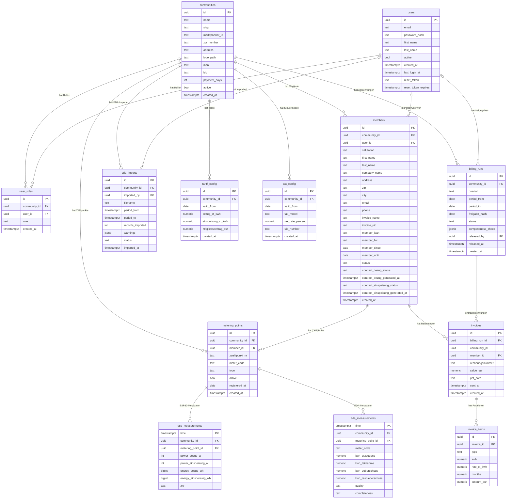

# ER-Diagramm — EEG-Plattform

Generiert aus `database/init.sql`. Aktuell halten wenn sich das Schema ändert.

## Rollen-Übersicht

| Rolle | community_id in Session | Zugriff |
|-------|------------------------|---------|
| `platform_admin` | NULL | Alle Communities (ohne RLS) |
| `manager` | UUID der eigenen EEG | Nur eigene Community (via RLS) |
| `member` | UUID der eigenen EEG | Nur eigene Community (via RLS) |

## Tabellen mit Row-Level Security

Alle Tabellen außer `communities`, `users`, `user_roles` haben RLS aktiviert.  
Policy: `community_id = current_setting('app.community_id', true)::uuid`
